> OBJECTIVE 

Build a docusaurus-powered site, deploy it to Azure Static Web Apps, automate builds with GitHub Actions - then use it to learn/test various features in the framework. Create a template that can be instantiated for other projects.

> STATUS

Currently built/

[](https://github.com/nitya/docusaurus-demo/actions/workflows/deploy.yml) 

[](https://github.com/nitya/docusaurus-demo/actions/workflows/pages/pages-build-deployment)

---

# DOCUSAURUS OVERVIEW

## 1. What is Docusaurus

Docusaurus is a framework (from Facebook/Meta) to help build single-page applications with a single focus usage: to _write and publish content_.

> FEATURES

 * Static site generator built with React. Born fast, accessible.
 * Markdown authoring, with [MDX](https://mdxjs.com/) components support 
 * First-class Typescript support
 * Localization support pre-configured (70 languages)
 * Built-in versioning and search support 
 * SEO friendly

> POPULARITY

 * Ranked #3 on [2021 Rising Stars in Static Sites](https://risingstars.js.org/2021/en#section-ssg) after Next, Astro.
 * Continuing upwards trend in [npm downloads](https://www.npmtrends.com/docusaurus-vs-@docusaurus/core)
 * Growing [Showcase](https://docusaurus.io/showcase) for real-world usage examples

> RESOURCES

 - read the [docs](https://docusaurus.io/docs)
 - learn the [CLI and API](https://docusaurus.io/docs/cli)
 - review [comparison with other tools](https://docusaurus.io/docs#comparison-with-other-tools) like Docsify, Gatsby, Jekyll and more. 
 - try [Playground](https://docusaurus.io/docs/playground) to explore Docusaurus without installing anything. 
 - fast track [Getting Started](https://docusaurus.io/docs) with docusaurus.

---

## 2. Docusaurus Cheatsheet

Quick commands to do the key actions related to creating, building, and previewing, the site contents during development.

| Command | Description |
|:--- |:--- |
| `npx create-docusaurus@latest <www> classic` | Create new site in folder `www/` with classic theme (fast track) |
| `cd www; npx docusaurus start` | Preview site locally (with hot reload) |
| `cd www/src/pages; touch <newpage.md>` | Creates a new standalone page that gets hosted at route: `/newpage`. Can be created as Markdown or as React component. |
| `cd www/docs; mkdir <group>; touch <group/page-X>.md` | Creates new collection of pages at `/docs/group` consisting of all `page-X` files. Group automatically gets `Previous/Next` navigation footers and automated `Sidebar` (customizable)  |
|`cd www/blog; touch <post.md>` | Create blog post. Blogging system supports index, tags, RSS feed - withc [fronmatter](https://docusaurus.io/docs/api/plugins/@docusaurus/plugin-content-docs#markdown-frontmatter) for better SEO. If post name takes form `<yyyy-mm-dd-slug.md>`, this is automatically mapped to publication date and route path.|
| `cd www; npm run build` | Builds static site (production files) in `build/` folder by default, ready for deployment. |
|`cd www; npm run serve`| Test production build locally. Explore [deployment guides](https://docusaurus.io/docs/deployment) to setup workflows to push build to relevant hosting provider. |

---

## 3. Features To Explore

Some features I hope to explore (and add tutorials on) with relevant docs links.

| | |
|:---| :---|
| [Markdown Frontmatter](https://docusaurus.io/docs/docs-markdown-features#markdown-frontmatter) | Metadata added to top of Markdown pages that translates to HTML meta tags (good for SEO). See available options for [docs](https://docusaurus.io/docs/api/plugins/@docusaurus/plugin-content-docs#markdown-frontmatter) and [blog](https://docusaurus.io/docs/api/plugins/@docusaurus/plugin-content-blog#markdown-frontmatter). |
| [MDX + React Components](https://docusaurus.io/docs/markdown-features/react) | Enhance Markdown with JSX syntax, allowing you to import and embed interactive content or components into pages. See [Example](https://tutorial.docusaurus.io/docs/tutorial-basics/markdown-features#mdx-and-react-components) of usage. Create [MDX Plugins](https://docusaurus.io/docs/markdown-features/plugins) for customization. |
| [Versioning](https://docusaurus.io/docs/versioning) | Helps maintain multiple versions of content (e.g., legacy, current, upcoming) - allowing older versions to be accessible even as current versions take priority.loca Try the [Versioning Tutorial](https://tutorial.docusaurus.io/docs/tutorial-extras/manage-docs-versions/)|
| [Localization - i8n](https://docusaurus.io/docs/i18n/introduction)| Setup content to support translations (with language-specific drop-down). Learn [translation workflow](https://docusaurus.io/docs/i18n/introduction#translation-workflow) and try to [translate your site](https://tutorial.docusaurus.io/docs/tutorial-extras/translate-your-site/) in this first tutorial.|
| [SEO - Search Engine Optimization](https://docusaurus.io/docs/seo) | Explore best practices to improve SEO including global meta attributes, page-specific meta attributes, robots file, rich text, structured content, sitemaps and more.|
| [Admonitions](https://docusaurus.io/docs/markdown-features/admonitions) | Enhanced syntax to support [remark](https://github.com/elviswolcott/remark-admonitions) callouts in content (note, tip, info, caution, danger) - can be used with Markdown, [MDX](https://docusaurus.io/docs/markdown-features/admonitions#admonitions-with-mdx) or [JSX](https://docusaurus.io/docs/markdown-features/admonitions#usage-in-jsx).|
| [Tabs](https://docusaurus.io/docs/markdown-features/tabs)| Enhanced Markdown feature > Tabbed Panes.|
| [Code Blocks](https://docusaurus.io/docs/markdown-features/code-blocks) | Enhanced Markdown feature > Code Highlighting .|
| [Inline TOC](https://docusaurus.io/docs/markdown-features/inline-toc) | Enhanced Markdown feature > Table Of Contents |
| [Assets](https://docusaurus.io/docs/markdown-features/assets) | Enhanced Markdown feature > Inline SVG, Themed Images, Files, etc.|
| [Math](https://docusaurus.io/docs/markdown-features/math-equations) | Enhanced Markdown feature > Math Equations.|
| [Head](https://docusaurus.io/docs/markdown-features/head-metadata) | Enhanced Markdown feature > Automatic and extensible `<head>` metadata|

---

# DEPLOYMENT OPTIONS


## 1. Deploy to GitHub Pages

Let's explore [this tutorial](https://docusaurus.io/docs/deployment#deploying-to-github-pages) to see how we can deploy this site to the GitHub Pages endpoint on this repo.

| Step | Description |
|:---|:---|
| 1. [Modify docusaurus.config.js](https://docusaurus.io/docs/deployment#docusaurusconfigjs-settings)  | Add `organizationName`=user, `projectName`=repo, `deploymentBranch`=gh-pages properties. <br/>Updated `url` property to relevant github.io version for now |
| 2. [Configure publishing source for GitHub Pages](https://docs.github.com/en/pages/getting-started-with-github-pages/configuring-a-publishing-source-for-your-github-pages-site)| Use the _Pages_ Settings to setup a default `gh-pages` branch. This publishes the page to [https://nitya.github.io/docusaurus-demo/](https://nitya.github.io/docusaurus-demo/) |
| 3. [Setup GitHub Actions for auto-deploy](https://docusaurus.io/docs/deployment#triggering-deployment-with-github-actions) | We want this to auto-deploy build to gh-pages when new commit is made to `main/`. Follow the directions for "Same" repo - add `deploy.yml` and `test-deploy.yml` to `.github/workflows` -- commit changes! I used `www/**` for paths) and `npm` for build)  |
| 4. [Visit Actions Dashboard](https://github.com/nitya/docusaurus-demo/actions) | Commits should trigger action - verify that build/deploy works. |
| 5. [Add CNAME for Custom Domain](https://docusaurus.io/docs/deployment#github-pages-overview) | Create `CNAME` file in static directory - move configuration back to `baseUrl:'/'` and set `url` to custom domain. Note that you need to [configure DNS](https://docs.github.com/en/pages/configuring-a-custom-domain-for-your-github-pages-site/managing-a-custom-domain-for-your-github-pages-site) on your domain provider site. Don't forget to "Enable HTTPS" in Pages settings. May need to wait a while before domain is activated!|
---

## 2. Deploy to Azure Static Web Apps

Learn more about [Azure Static Web Apps](https://docs.microsoft.com/en-us/azure/static-web-apps/publish-gatsby) then explore tutorials like [this one](https://dev.to/sumitkharche/deploy-a-docusaurus-app-on-azure-static-web-apps-2dpj). I'll update this section with a detailed tutorial based on my workflow when done.

> TODO

| | |
|:---|:---|
| | |

---

# CONTENT CREATION

I'll capture any notes/a-ha moments from my exploration here.


## 1. [Customize Styling](https://docusaurus.io/docs/styling-layout#global-styles)

> Use the [recommended tool](https://docusaurus.io/docs/styling-layout#styling-your-site-with-infima) to generate a color palette that works for dark/light modes etc. Use [Themed Images](https://docusaurus.io/docs/markdown-features/assets#themed-images) to provide alternate versions of images suitable for dark/light themes. |

In the last step for instance, you can generate CSS styles for dark and light modes that are optimized for contrast etc. as seen below. 

| | |
|:---| :---|
| 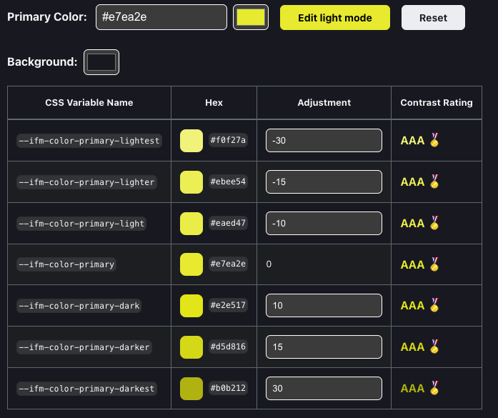 | 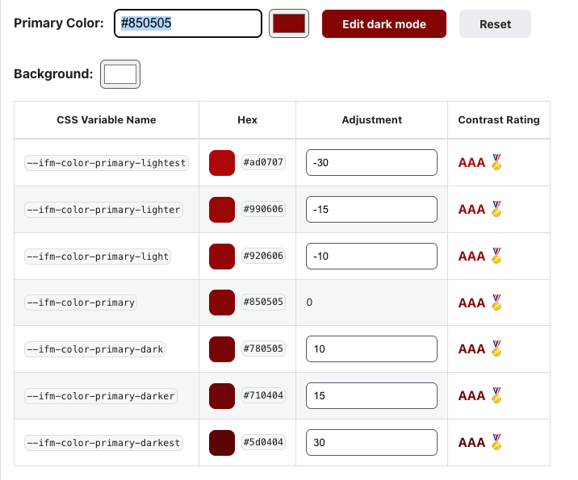 |

This gives you nice themed pages for your site! 

| | |
|:---| :---|
| 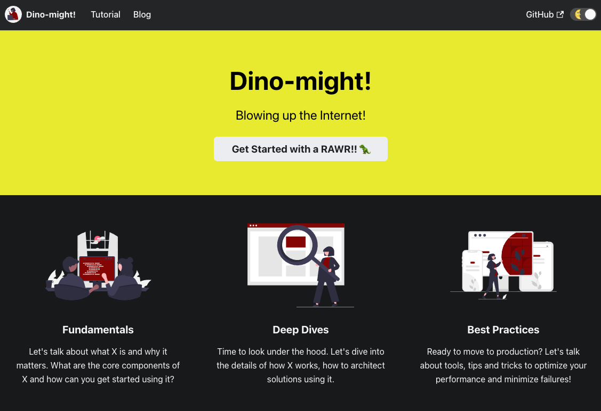 | 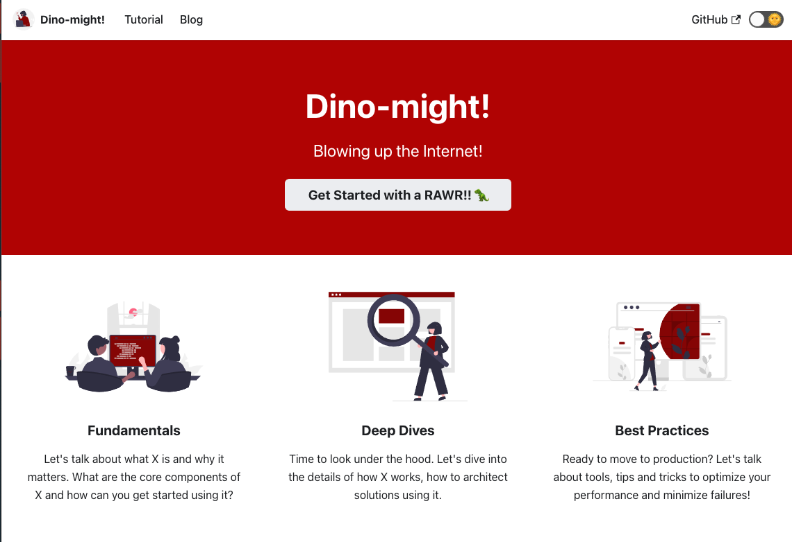 |

TODO: Try ThemedImages to match dark/light mode.

> REFACTORING DEFAULT SITE

Before diving into PWA refactoring, let's get the base content in order. Specifically:
 * Clean up unused files
 * Create (or clean up) sample blog post
 * Create (or clean up) sample document

There are three kinds of content to work with: Pages (standalone), Documents (collections) and Blogs (timestamped posts). Customization happens in 2 ways:
 * configuration at `docusaurus.config.js`
 * configuration via Markdown frontmatter in page.

We'll look at these next.

---

## 2. [Work with Pages](https://docusaurus.io/docs/creat.ing-pages)

Things to know:
 * These are _standalone_ pages e.g., an "About" page for site.
 * Pages can be created as _Markdown (.md) or React (.js)_.
 * Pages are then _accessible at routes mapped to that path_ e.g.
    - /src/pages/index.js → [baseUrl]
    - /src/pages/foo.js → [baseUrl]/foo
    - /src/pages/foo/test.js → [baseUrl]/foo/test
    - /src/pages/foo/index.js → [baseUrl]/foo/

---

## 3. [Work with Docs](https://docusaurus.io/docs/docs-introduction)

Things to know:
 * These organize pages into "collections" with a hierarchy.
 * Hierarchy drives automatic navigational cues (Previous/Next)
 * Sidebar provides automatic (and explicitly customizable) listings
 * Docs have default unique `id` (filename) that maps to their route
 * You can customize id (+ other properties) in [docs frontmatter](https://docusaurus.io/docs/api/plugins/@docusaurus/plugin-content-docs#markdown-frontmatter).
 * You can [reference other docs](https://docusaurus.io/docs/docs-markdown-features) intuitively.
 * Customize sidebar [for docs](https://docusaurus.io/docs/sidebar) using frontmatter (local) or `sidebar.js` (global).
 * Customize sidebar [for categories](https://docusaurus.io/docs/sidebar#autogenerated-sidebar-metadata) further in `_category_.json` local files.
 * Make sidebar [hideable](https://docusaurus.io/docs/sidebar#hideable-sidebar) in `docusaurus.config.js` (in _themeConfig_)
 * Understand sidebar [association](https://docusaurus.io/docs/sidebar#using-multiple-sidebars) if listing page in multiple sidebars.
 * Explore [versioning](https://docusaurus.io/docs/versioning) to evolve docs while keeping legacy accessible.
 * Check out this [complex example](https://docusaurus.io/docs/sidebar#complex-sidebars-example) to see all customizability options.

---

## 4. [Work with Blogs](https://docusaurus.io/docs/blog)

Things to know:
 * Add [new blog posts](https://docusaurus.io/docs/blog) in `blog/` folder
 * Use `<!--truncate-->` [in your post](https://docusaurus.io/docs/blog#blog-list) to mark cutoff for index summary.
 * Edit [`docusaurus.config.js`](https://docusaurus.io/docs/blog#blog-sidebar) to config pagination, sidebar, reading time etc.
 * Use [`authors.yml`](https://docusaurus.io/docs/blog#global-authors) to define global authors, reference in frontmatter.
 * Configure [feed](https://docusaurus.io/docs/blog#feed) or disable it, via `docusaurus.config.js`.

---

# ADVANCED CONCEPTS

## 1. Progressive Web Apps

[Progressive Web App](https://docs.microsoft.com/en-us/microsoft-edge/progressive-web-apps-chromium/) are about leveraging new capabilities in web browser APIs and standards to drive richer user experiences - implementing a _progressive enhancement_ approach that continues to deliver functional and valid experiences on older platforms that lack these features.

With PWA, you get the reach of web apps with the richer experience of platform (native) apps. Making a web app a PWA requires us to focus on three things:
 * _Reliability_ = does it work offline like native apps do?
 * _Installability_ = can it be launched from home screens like native apps?
 * _Capability_ = can it leverage rich platform APIs like native apps do?

### 1.1 [Run a Lighthouse Audit](https://developers.google.com/web/tools/lighthouse/)

Lighthouse is an open-source tool for improving quality of web pages by auditing it for _performance, accessibility, PWA, SEO, and more_. The easiest way is to [run it in DevTools](https://developers.google.com/web/tools/lighthouse/#devtools) (in a Chromium-powered browser like Google Chrome, Microsoft Edge or Brave) and review the generated report. Here is the result for my initial [deployed site](https://docu-demo.nitya.dev)

| | |
|:---| :---|
| 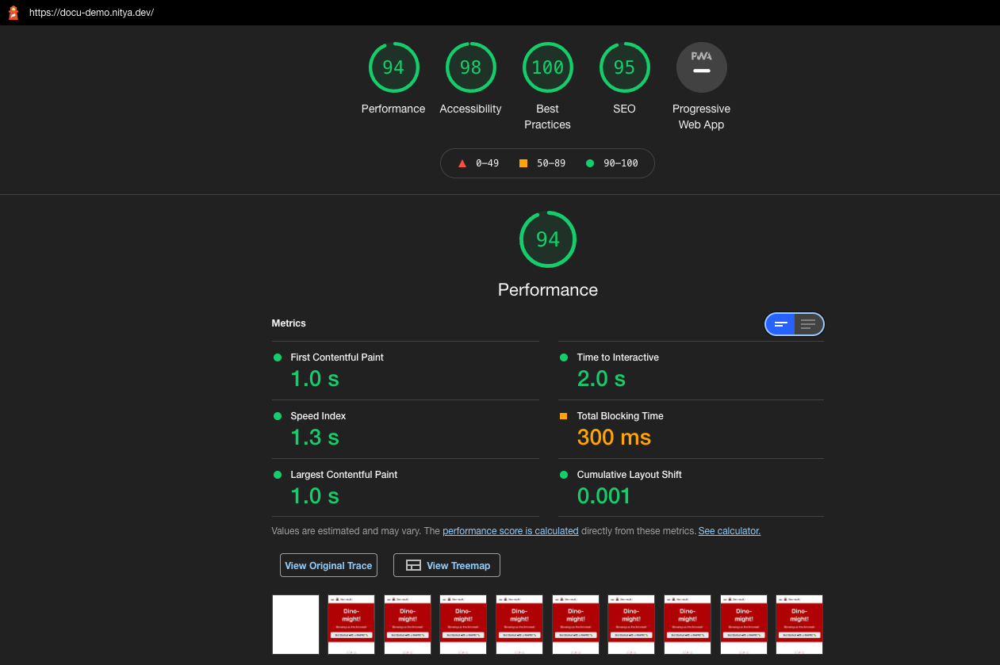 | 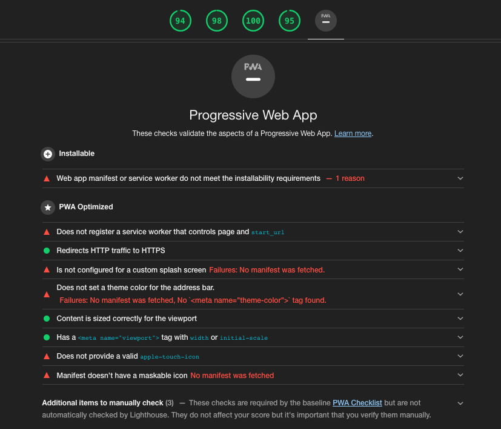 |

This gives you a checklist of things to fix with recommendations on how to fix them.

### 1.2 [Audit with PWA Builder](https://www.pwabuilder.com/)

For the PWA part, you can go one step better and run a  [PWABuilder Audit](https://blog.pwabuilder.com/posts/introducing-the-brand-new-pwa-builder/) - it also gives you a score, and has a nice web interface where you can interactively configure options to _generate_ the fixes required to improve it.

Plus - if you want to _ship_ your PWA to an app store (Microsoft - Windows, Google Play - Android, Apple - iOS) as well, the site has resources to guide you through the process and ensure your PWA is store-ready.

| Here is the initial PWABuilder audit report for the [deployed website](https://docu-demo.nitya.dev/). |
|:---|
| 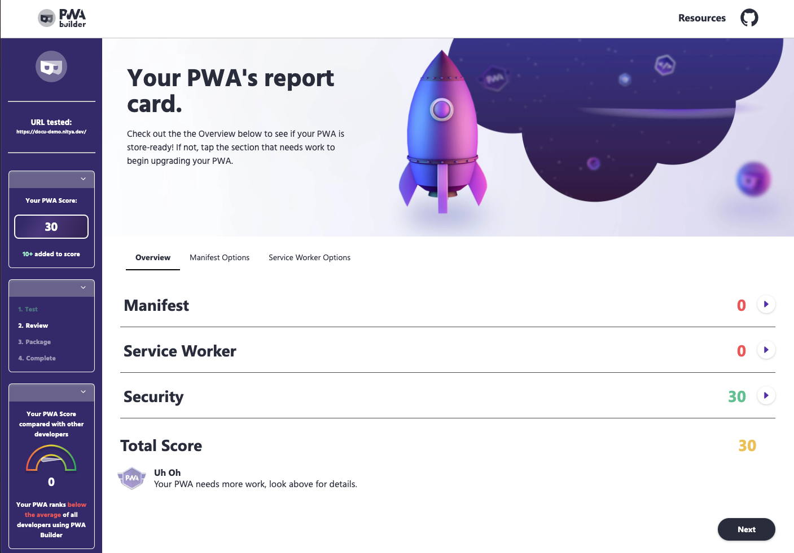 |
| Looks like we need to put in a bit of work - starting with adding a Manifest and Service Worker, then iteratively auditing for performance and other optmizations. The report does provide us assistance in creating the required files interactively. |


### 1.3 Fix it with plugin-pwa

Docusaurus has a [plugin-pwa](https://docusaurus.io/docs/api/plugins/@docusaurus/plugin-pwa) to create a website with both offline and installation support.
Let's use this - then run the audit again to see what changes in scoring.

> 1. CREATE & LINK APP MANIFEST

Learn about [Web App Manifest](https://developer.mozilla.org/en-US/docs/Web/Manifest) here. 

PWABuilder lets you create icons, screenshots and manifest interactively - so I used it.

  * Icons - Download the generated icons and save to a location inside `www/static`. I've saved mine in `static/img/icons`.
  * Screenshots - Download the mobile and desktop versions of screenshots for specific routes of interest, and save as before. I've saved mine in `static/img/screenshots`.
  * Manifest - Fill in the details interactively in the form. Generate manifest and save the file to `static/manifest.json`. This is what you get initially.
 
 ```
 {
    "background_color": "none",
    "description": "A sandbox app to explore various features of the Docusaurus static site builder. Use as a template for other projects, or browse the tutorials section to build  this from scratch.",
    "dir": "ltr",
    "display": "standalone",
    "name": "Docusaurus Demo",
    "orientation": "portrait-primary",
    "scope": "/",
    "short_name": "Docu-Demo",
    "start_url": "/",
    "theme_color": "#af0404",
    "categories": [],
    "screenshots": [],
    "shortcuts": []
  }
 ```

 * Update the manifest to provide locations for the downloaded screenshots and icons. Reference the [screenshot example](https://developer.mozilla.org/en-US/docs/Web/Manifest/screenshots) and [icons example](https://developer.mozilla.org/en-US/docs/Web/Manifest/icons) to learn what to add. 
 
 Here is what my additions looks like - note that relative paths are w.r.t location of `manifest.json`. Note - for now the `icons/` directory contains all sizes generated by PWABuilder - but at some point we can remove all the ones that are not listed in the Manifest (for efficiency).
 
 ```
 "screenshots" : [
  {
    "src": "img/screenshots/home-desktop",
    "sizes": "1280x800",
    "platform": "wide",
    "label": "Homescreen of Docusaurus Demo PWA"
  },
  {
    "src": "img/screenshots/home-mobile",
    "sizes": "750x1334",
    "platform": "narrow",
    "label": "Homescreen of Docusaurus Demo PWA"
  },
  {
    "src": "img/screenshots/blog-desktop",
    "sizes": "1280x800",
    "platform": "wide",
    "label": "Blog page of Docusaurus Demo PWA"
  },
  {
    "src": "img/screenshots/blog-mobile",
    "sizes": "750x1334",
    "platform": "narrow",
    "label": "Blog page of Docusaurus Demo PWA"
  },
],
"icons": [
    {
      "src": "img/icons/icon-72x72.png",
      "sizes": "72x72",
      "type": "image/png"
    },
    {
      "src": "img/icons/icon-96x96.png",
      "sizes": "96x96",
      "type": "image/png"
    },
    {
      "src": "img/icons/icon-128x128.png",
      "sizes": "128x128",
      "type": "image/png"
    },
    {
      "src": "img/icons/icon-144x144.png",
      "sizes": "144x144",
      "type": "image/png"
    },
    {
      "src": "img/icons/icon-152x152.png",
      "sizes": "152x152",
      "type": "image/png"
    },
    {
      "src": "img/icons/icon-192x192.png",
      "sizes": "192x192",
      "type": "image/png"
    },
    {
      "src": "img/icons/icon-388x388.png",
      "sizes": "388x388",
      "type": "image/png"
    },
    {
      "src": "img/icons/icon-512x512.png",
      "sizes": "512x512",
      "type": "image/png"
    }
]
 ```
 
 * This is also a good time to update the `static/img/favicon.ico` with an icon that matches your brand. I used the [favicon converter](https://favicon.io/favicon-converter/) site to generate a favicon from one of the icon images.


> 2. CONFIGURE THE PLUGIN

Docusaurus [plugin-pwa](https://docusaurus.io/docs/api/plugins/@docusaurus/plugin-pwa) is configured as follows:

 * Install the plugin: `$cd www; npm install --save @docusaurus/plugin-pwa` 
 * Requires Manifest to be in `static/manifest.json`. See an [example manifest](https://docusaurus.io/docs/api/plugins/@docusaurus/plugin-pwa#manifest-example) for reference.
 * Requires `docusaurus.config.js` to be updated to configure plugin - see [example](https://docusaurus.io/docs/api/plugins/@docusaurus/plugin-pwa#configuration) and [supported options](https://docusaurus.io/docs/api/plugins/@docusaurus/plugin-pwa#options).

This configures your app to use the referenced manifest (to set as `<HEAD>` link) and set the relevant policies (for service worker).

> 3. TEST PWA

How can you check if the PWA functionality is working correctly, and if there are ways to improve it.

> 1. TEST APP LOCALLY

The plugin activates only for production builds. So clear-build-and-serve on `https://localhost:3000` to run locally.

```
$ cd www/
$ npm run clear
$ npm run build
$ npm run serve
```

Then _inspect_ the webpage - e.g., in a Chromium-powered browser (e.g., Microsoft Edge or Google Chrome) - and look for the _Applications_ tab. 
|Check out the Manifest section - it should let you know of any issues to be addressed.| Check out the Service Workers section. It should show a registered worker.|
|:---|:---|
|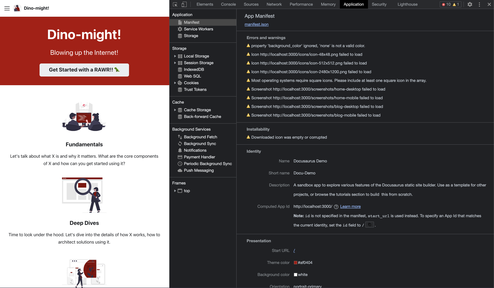|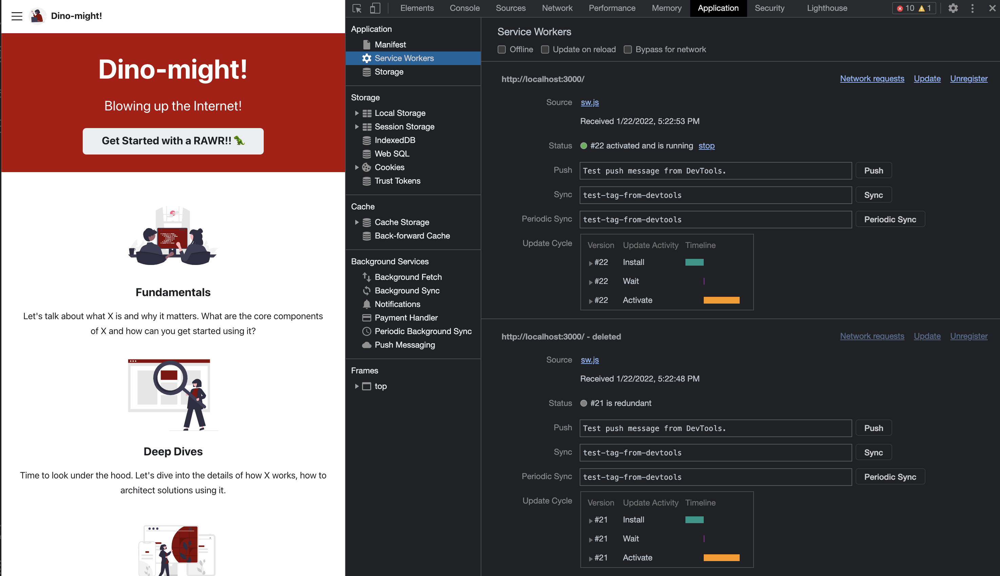|

If you can see something similar, it tells you that the pwa-plugin is configured correctly. Now all we have to do is start fixing the issues. 


> 2. RUN PWA AUDITS

First, let's re-run audits so we can get a list of all issue at one shot, before starting fixes. First, push the deploy to remote host so it is publicly accessible.

`LIGHTHOUSE AUDIT`:

Visit [the deployed page](https://docu-demo.nitya.dev) in a Chromium-powered browser (Google Chrome, Microsoft Edge, Brave etc.). Then `inspect` the page and click `Generate Report` in the Lighthouse tab.Run it for the default `mobile` option, then repeat with `desktop` to audit page performance for both narrow-screen and wide-screen device form factors. _Yes!! Our scores have improved!_.

| | |
|:---| :---|
|Lighthouse Report - Mobile  |  Lighthouse Report - Desktop. |
| 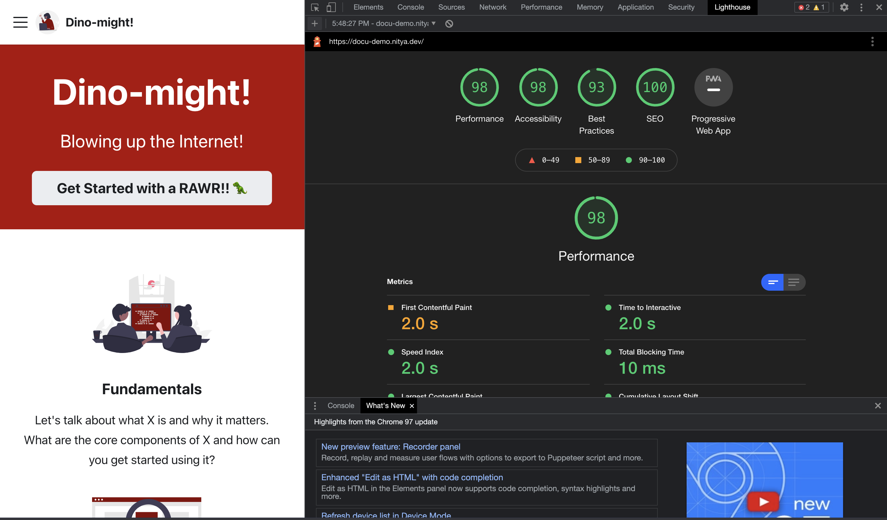 | 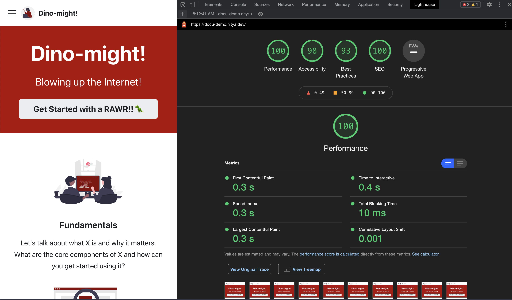 |


`PWABUILDER AUDIT`:

Visit the [PWA Builder](https://www.pwabuilder.com) site and enter your [site URL](https://docu-demo.nitya.dev) for auditing. Here's my new report - along with some guidance on improvements to make it appstore-ready.

| | |
|:---| :---|
| **PWABuilder Report** - _note how our scores have improved dramatically from 30 to 160!_ |  **PWA Builder Alert** - _provides [actionable advice](https://docs.microsoft.com/en-us/microsoft-edge/progressive-web-apps-chromium/how-to/icon-theme-color#define-icons) to make PWA appstore-ready_. |
| 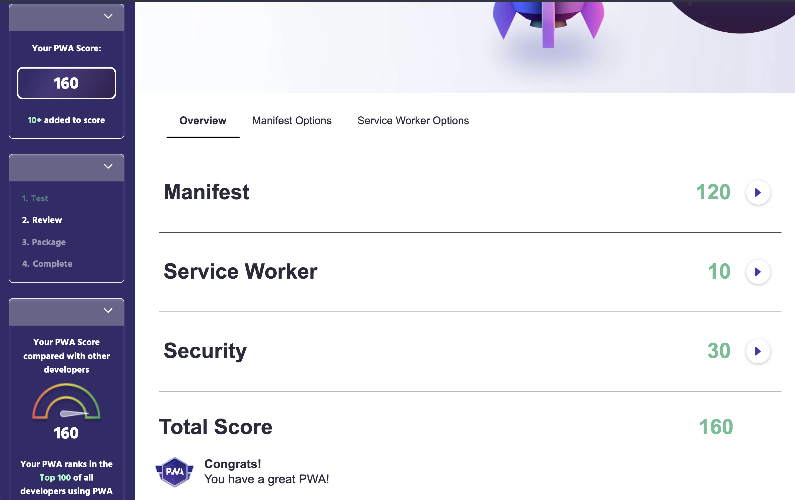 | 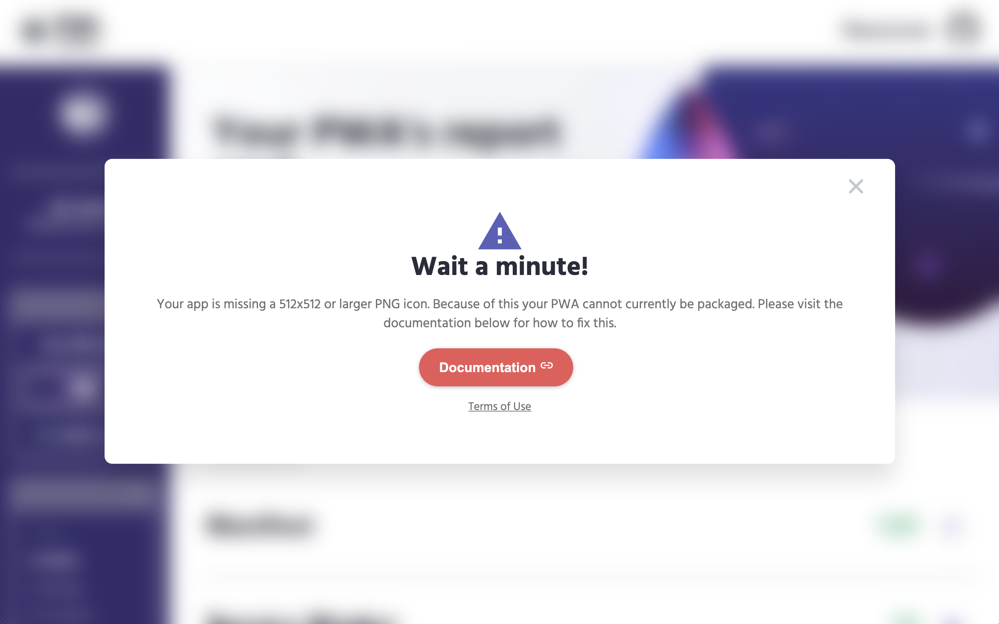 |


> 3. TEST PWA CAPABILITIES

We have a PWA-enabled site deployed! Let's test it for two key features that differentiate PWA from regular web apps:

 * [App Installation](https://docusaurus.io/docs/api/plugins/@docusaurus/plugin-pwa#app-installation-support) - can I install this to home screen and use it like a native app?
 * [Offline Mode (Precaching)](https://docusaurus.io/docs/api/plugins/@docusaurus/plugin-pwa#offline-mode-precaching) - does the site remain accessible when I am offline?

 Let's look at each of these.

 > 1. APP INSTALLATION

 Can I install this app on my home screen (e.g., on mobile) and have it be accessible on my dock (e.g., desktop) and via other means (e.g., Search) just like native apps? 
 
 Let's try it out. See guidance on [How to install and uninstall apps](https://developer.mozilla.org/en-US/docs/Web/Progressive_web_apps/Installing) on various mobile and desktop browsers. Also see: [App Installation | Docusaurus](https://docusaurus.io/docs/api/plugins/@docusaurus/plugin-pwa#app-installation-support)
 
 

| | **Here is what my experience with Microsoft Edge (browser) on a macOS laptop (device) looks like.** |
|:---|:---|
| Tap the `...` on Edge browsers, navigate to `Apps > Install This Site As An App` to trigger install. | 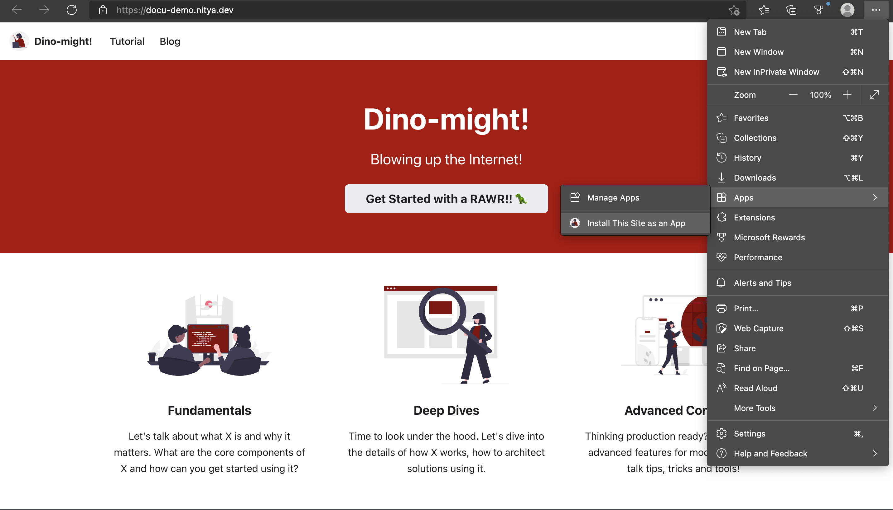 |
| This is the installed _standalone_ app experience. <br/> Notice the lack of browser chrome (no address bar) - and alert indicating new version available. | 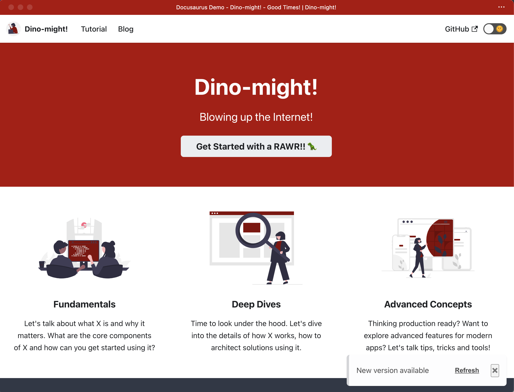 |
| And this is my dock on macOS - note how I can pink this to dock and launch instantly, just like native.| 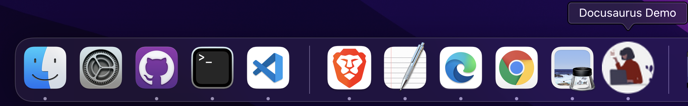 |


 > 2. OFFLINE MODE

A big advantage of platform-specific (native) apps is their ability to function even when the device is offline. Can we get the same kind of reliable offline access in PWA? That's what service workers do for us.

Let's try it out. Install the app using the browser-appropriate actions. For example:
 * in mobile Chrome: click "..." then select `Add To Home Screen`
 * in mobile Edge: click "..." then select `Add To Phone`.

In either case, you should now see a launcher icon on your home screen, its name corresponding to that given in your manifest. 
 * On my Android phone, I also see a subtle browser icon (Edge or Chrome) inside the launcher icon, to let me know which browser PWA was installed from.
 * I have different browsers associated with different profiles (Personal vs. Work) on my Android Phone. And, just like other native apps, the installed PWA launcher icon is enabled only when the relevant profile is active.

Now, put your phone into `Flight mode` (effectively offline).
 * Launch a standard browser now and go to your [site link](https://docu-demo.nitya.dev), you should get the dreaded `No internet` page indicating the device is offline.
 * Now try launching the installed PWA from home screen. It should launch _and_ allow you to navigate to other links (e.g., visit Home, Blog and Tutorial pages). 

An installable and offline-ready PWA ftw! Also see: [Offline Mode (Precaching)](https://docusaurus.io/docs/api/plugins/@docusaurus/plugin-pwa#offline-mode-precaching)

> 3. FIXING AUDIT-IDENTIFIED ISSUES

We now have a working PWA but the audit identifies a number of issues we can fix. Let's do that next - for now we don't need to fix _everything_ - for example, we can wait to learn more about service worker caching strategies before exploring some of those fixes. But we can fix simpler things like manifest updates. Next.


---

## 2. End-to-End Testing


---