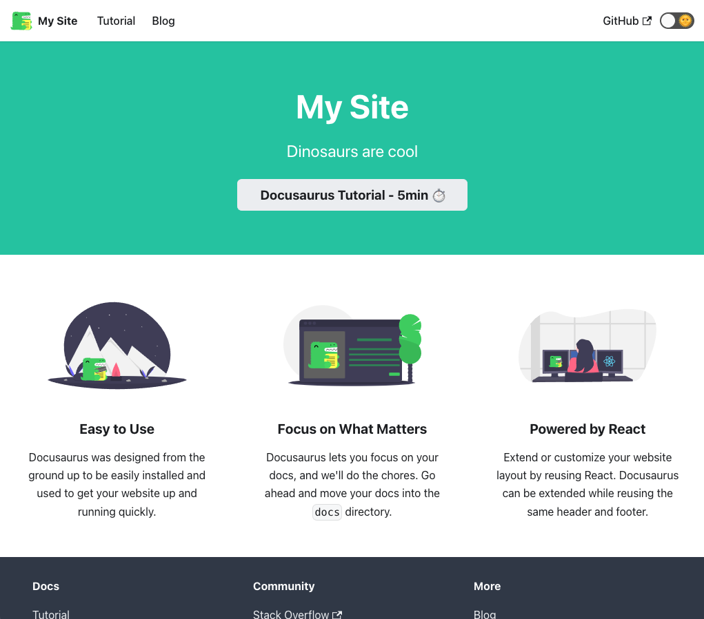

# Docusaurus Demo

> OBJECTIVE 

Build a docusaurus-powered site, deploy it to Azure Static Web Apps, automate builds with GitHub Actions - then use it to learn/test various features from the framework.

---

## 1. What is Docusaurus

Docusaurus is a framework (from Facebook/Meta) to help build single-page applications with a single focus usage: to _write and publish content_.

Key features:

 * Static site generator built with React
 * Markdown authoring, first-class Typescript support
 * Localization support pre-configured (70 languages)
 * Built-in versioning and search support 

[Read the docs](https://docusaurus.io/docs) for more details - including their [comparison with other tools](https://docusaurus.io/docs#comparison-with-other-tools) like Docsify, Gatsby, Jekyll and more. Try their [Playground](https://docusaurus.io/docs/playground) to explore Docusaurus without installing anything.

---

## 2. Install Docusaurus

I'm going with the [Fast Track](https://docusaurus.io/docs#fast-track) approach.

> 1. Install Node.JS

I use [Node Version Manager](https://github.com/nvm-sh/nvm) for this. My current local environment :

```
$ node --version
v16.2.0
$ npm --version
7.13.0
```

> 2. Create new docusaurus site

This command uses the classic theme for Docusaurus, and scaffolds the source in the `www/` folder. You can also use the npm (try: `$ npm init docusaurus@latest www classic`) instead of npx - with same result.

```
$npx create-docusaurus@latest www classic
[INFO] Creating new Docusaurus project...
[INFO] Installing dependencies with npm...
..
..
npm ERR! Could not resolve dependency:
npm ERR! peer react@"^16.13.1" from @mdx-js/runtime@1.6.22
npm ERR! Fix the upstream dependency conflict, or retry
npm ERR! this command with --force, or --legacy-peer-deps
npm ERR! to accept an incorrect (and potentially broken) dependency resolution.
..
..
[INFO] The site directory has already been created, and you can retry by typing:

  `cd www`
  `npm install`

```
For now, I chose to override this with `--force`

```
$ cd www
$ npm install --force
npm WARN using --force Recommended protections disabled.
```

Success! 


---

## 3. Explore Scaffolded Site

Running the command below launches the browser to that identified localhost URL automatically.

```
$ cd www
$ npx docusaurus start
[INFO] Starting the development server...
[SUCCESS] Docusaurus website is running at http://localhost:3000/.
```
This is what the default landing page looks like: 



And this is what the default `www/` contents are (output simplified for clarity)
```
$ ls -l
README.md		
blog/			
docusaurus.config.js	
package-lock.json	
sidebars.js		
static/
babel.config.js		
docs/			
node_modules/		
package.json		
src/
```

The default [project structure](https://docusaurus.io/docs/installation#project-structure) has these files/folders of note:
 * `blog/` - for blog posts. See [blog guide](https://docusaurus.io/docs/blog)
 * `docs/` - for blog posts. See [docs guide](https://docusaurus.io/docs/docs-markdown-features)
 * `src/` - for custom React components or non-documentation content
 * `src/pages` - contents converted to site pages. See [pages guide](https://docusaurus.io/docs/creating-pages)
 * `static/` - directory for static assets (copied as-is to root of `build/`)

Three configuration files to note:
 * `package.json` = React app config via npm
 * `docusaurus.config.js` = Global site configuration
 * `sidebar.js` - used by documentation to list docs order in sidebar

The development server has built-in hot reload - changes made to content will be immediately previewed in locally-served site for quick debug.

---

## 4. Build Static Site For Deploy

Using npm:

```
$ cd www/
$ npm run build

> www@0.0.0 build
> docusaurus build

[INFO] [en] Creating an optimized production build...
..
..
[SUCCESS] Generated static files in build.
[INFO] Use `npm run serve` command to test your build locally.
```

Let's see what the build contents are - note that this is quite SEO-friendly with individual html pages for key sections. 

```
$ ls build/*

build/404.html          
build/index.html        
build/sitemap.xml

build/assets:
    css/     
    images/  
    js/

build/blog:
    archive/         
    first-blog-post/ 
    long-blog-post/  
    rss.xml         
    welcome
    atom.xml        
    index.html      
    mdx-blog-post/   
    tags/
    welcome/
    atom.xml
    index.html
    rss.xml

build/docs:
    intro/           
    tutorial-basics/
    tutorial-extras/

build/img:
    docusaurus.png                  
    logo.svg
    undraw_docusaurus_mountain.svg 
    undraw_docusaurus_tree.svg
    favicon.ico                 
    tutorial/                    
    undraw_docusaurus_react.svg

build/markdown-page:
    index.html

```


---

## 5. Test Static Build locally

As recommended, you can serve the static build locally as follows:

```
$ cd www/
$ npm run serve

> www@0.0.0 serve
> docusaurus serve

[SUCCESS] Serving build directory at http://localhost:3000/.
```

---

## 6. Complete Tutorial-Basics

The Fast Track install workflow sets up a site example with a [5-minute tutorial](http://localhost:3000/docs/intro) and a [sample blog](http://localhost:3000/blog) by default.

Working through these is a good way to convert the boilerplate site into a first version of the real site you want to build. 

These are the features we walk through next.

 * Create a Page
 * Create a Document
 * Create a Blog Post
 * Customize with Markdown
 * Deploy Your Site
 * Manage Docs Versions
 * Translate Your Site

