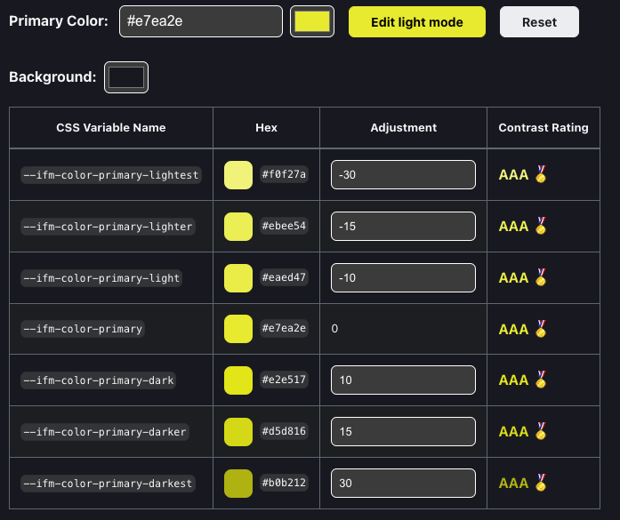
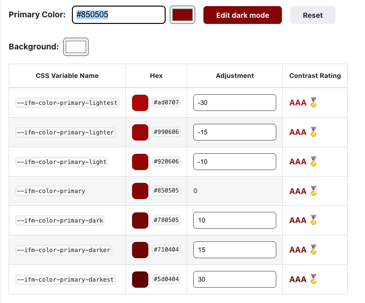
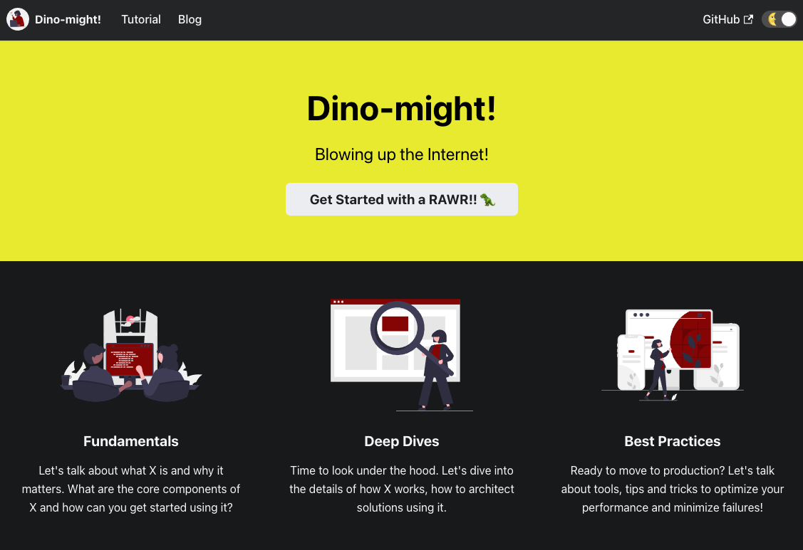
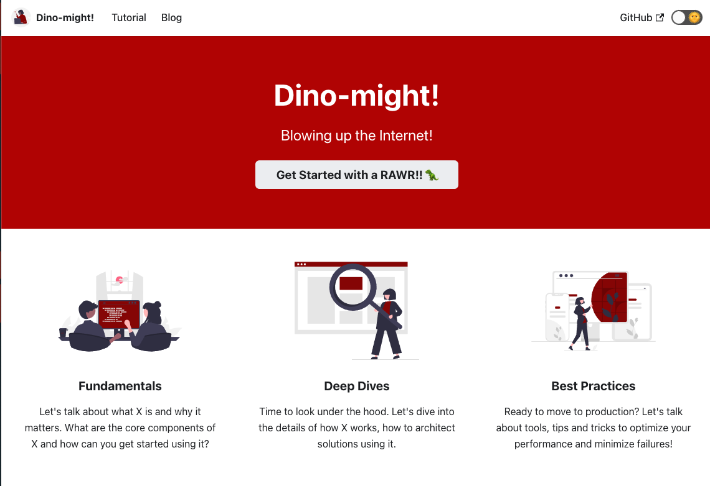
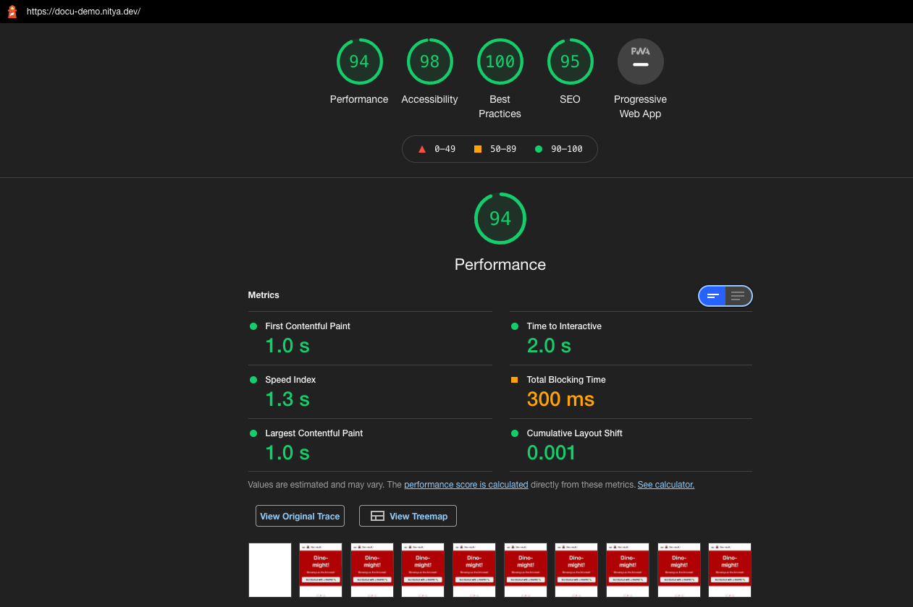
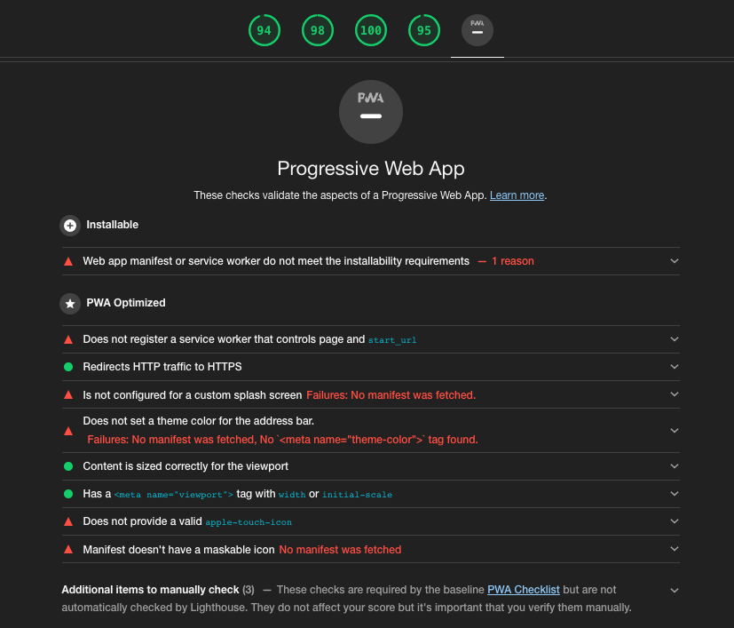
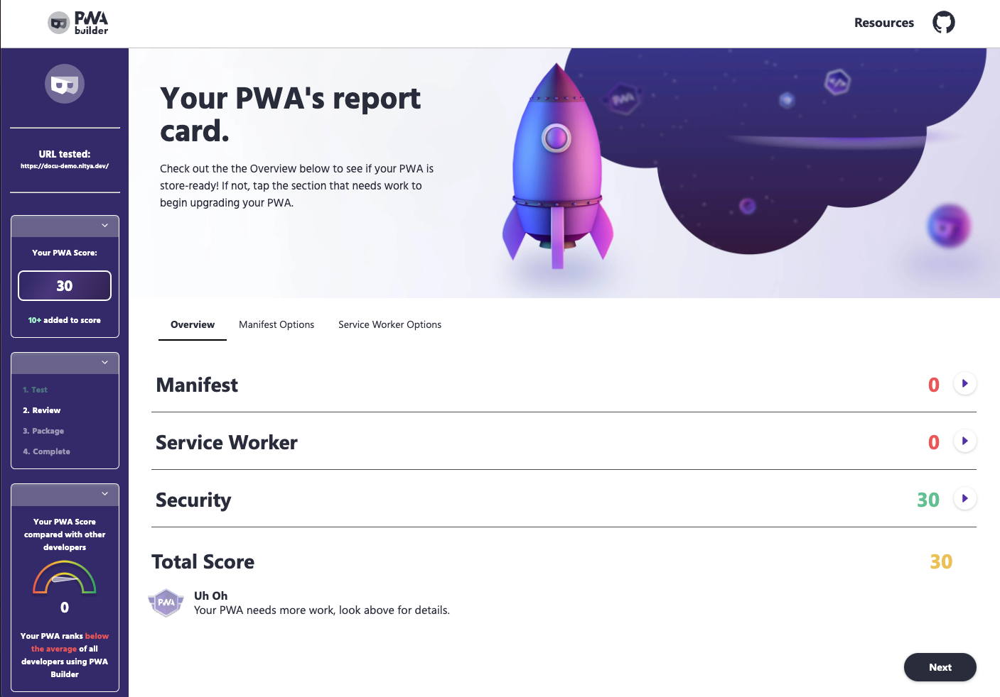

# Docusaurus Demo

> OBJECTIVE 

Build a docusaurus-powered site, deploy it to Azure Static Web Apps, automate builds with GitHub Actions - then use it to learn/test various features from the framework.

 | 

---

## 1. What is Docusaurus

Docusaurus is a framework (from Facebook/Meta) to help build single-page applications with a single focus usage: to _write and publish content_.

Key features:

 * Static site generator built with React. Born fast, accessible.
 * Markdown authoring, with [MDX](https://mdxjs.com/) components support 
 * First-class Typescript support
 * Localization support pre-configured (70 languages)
 * Built-in versioning and search support 
 * SEO friendly

Adoption Trends: 
 * Ranked #3 on [2021 Rising Stars in Static Sites](https://risingstars.js.org/2021/en#section-ssg) after Next, Astro.
 * Continuing upwards trend in [npm downloads](https://www.npmtrends.com/docusaurus-vs-@docusaurus/core)

For more details:
 - read the [docs](https://docusaurus.io/docs)
 - learn the [CLI and API](https://docusaurus.io/docs/cli)
 - review [comparison with other tools](https://docusaurus.io/docs#comparison-with-other-tools) like Docsify, Gatsby, Jekyll and more. 
 - try [Playground](https://docusaurus.io/docs/playground) to explore Docusaurus without installing anything. 
 - explore [Showcase](https://docusaurus.io/showcase) for real-world usage examples.
 - fast track [Getting Started](https://docusaurus.io/docs) with docusaurus.

---

## 2. Quick Commands

| Command | Description |
|:--- |:--- |
| `npx create-docusaurus@latest <www> classic` | Create new site in folder `www/` with classic theme (fast track) |
| `cd www; npx docusaurus start` | Preview site locally (with hot reload) |
| `cd www/src/pages; touch <newpage.md>` | Creates a new standalone page that gets hosted at route: `/newpage`. Can be created as Markdown or as React component. |
| `cd www/docs; mkdir <group>; touch <group/page-X>.md` | Creates new collection of pages at `/docs/group` consisting of all `page-X` files. Group automatically gets `Previous/Next` navigation footers and automated `Sidebar` (customizable)  |
|`cd www/blog; touch <post.md>` | Create blog post. Blogging system supports index, tags, RSS feed - withc [fronmatter](https://docusaurus.io/docs/api/plugins/@docusaurus/plugin-content-docs#markdown-frontmatter) for better SEO. If post name takes form `<yyyy-mm-dd-slug.md>`, this is automatically mapped to publication date and route path.|
| `cd www; npm run build` | Builds static site (production files) in `build/` folder by default, ready for deployment. |
|`cd www; npm run serve`| Test production build locally. Explore [deployment guides](https://docusaurus.io/docs/deployment) to setup workflows to push build to relevant hosting provider. |

---

## 3. Key Features To Explore

| | |
|:---| :---|
| [Markdown Frontmatter](https://docusaurus.io/docs/docs-markdown-features#markdown-frontmatter) | Metadata added to top of Markdown pages that translates to HTML meta tags (good for SEO). See available options for [docs](https://docusaurus.io/docs/api/plugins/@docusaurus/plugin-content-docs#markdown-frontmatter) and [blog](https://docusaurus.io/docs/api/plugins/@docusaurus/plugin-content-blog#markdown-frontmatter). |
| [MDX + React Components](https://docusaurus.io/docs/markdown-features/react) | Enhance Markdown with JSX syntax, allowing you to import and embed interactive content or components into pages. See [Example](https://tutorial.docusaurus.io/docs/tutorial-basics/markdown-features#mdx-and-react-components) of usage. Create [MDX Plugins](https://docusaurus.io/docs/markdown-features/plugins) for customization. |
| [Versioning](https://docusaurus.io/docs/versioning) | Helps maintain multiple versions of content (e.g., legacy, current, upcoming) - allowing older versions to be accessible even as current versions take priority.loca Try the [Versioning Tutorial](https://tutorial.docusaurus.io/docs/tutorial-extras/manage-docs-versions/)|
| [Localization - i8n](https://docusaurus.io/docs/i18n/introduction)| Setup content to support translations (with language-specific drop-down). Learn [translation workflow](https://docusaurus.io/docs/i18n/introduction#translation-workflow) and try to [translate your site](https://tutorial.docusaurus.io/docs/tutorial-extras/translate-your-site/) in this first tutorial.|
| [SEO - Search Engine Optimization](https://docusaurus.io/docs/seo) | Explore best practices to improve SEO including global meta attributes, page-specific meta attributes, robots file, rich text, structured content, sitemaps and more.|
| [Admonitions](https://docusaurus.io/docs/markdown-features/admonitions) | Enhanced syntax to support [remark](https://github.com/elviswolcott/remark-admonitions) callouts in content (note, tip, info, caution, danger) - can be used with Markdown, [MDX](https://docusaurus.io/docs/markdown-features/admonitions#admonitions-with-mdx) or [JSX](https://docusaurus.io/docs/markdown-features/admonitions#usage-in-jsx).|
| [Tabs](https://docusaurus.io/docs/markdown-features/tabs)| Enhanced Markdown feature > Tabbed Panes.|
| [Code Blocks](https://docusaurus.io/docs/markdown-features/code-blocks) | Enhanced Markdown feature > Code Highlighting .|
| [Inline TOC](https://docusaurus.io/docs/markdown-features/inline-toc) | Enhanced Markdown feature > Table Of Contents |
| [Assets](https://docusaurus.io/docs/markdown-features/assets) | Enhanced Markdown feature > Inline SVG, Themed Images, Files, etc.|
| [Math](https://docusaurus.io/docs/markdown-features/math-equations) | Enhanced Markdown feature > Math Equations.|
| [Head](https://docusaurus.io/docs/markdown-features/head-metadata) | Enhanced Markdown feature > Automatic and extensible `<head>` metadata|

---

## 4. Deployment to GitHub Pages

Let's explore [this tutorial](https://docusaurus.io/docs/deployment#deploying-to-github-pages) to see how we can deploy this site to the GitHub Pages endpoint on this repo.

| Step | Description |
|:---|:---|
| 1. [Modify docusaurus.config.js](https://docusaurus.io/docs/deployment#docusaurusconfigjs-settings)  | Add `organizationName`=user, `projectName`=repo, `deploymentBranch`=gh-pages properties.  Updated `url` property to relevant github.io version for now |
| 2. [Configure publishing source for GitHub Pages](https://docs.github.com/en/pages/getting-started-with-github-pages/configuring-a-publishing-source-for-your-github-pages-site)| Use the _Pages_ Settings to setup a default `gh-pages` branch. This publishes the page to [https://nitya.github.io/docusaurus-demo/](https://nitya.github.io/docusaurus-demo/) |
| 3. [Setup GitHub Actions for auto-deploy](https://docusaurus.io/docs/deployment#triggering-deployment-with-github-actions) | We want this to auto-deploy build to gh-pages when new commit is made to `main/`. Follow the directions for "Same" repo - add `deploy.yml` and `test-deploy.yml` to `.github/workflows` -- commit changes! I used `www/**` for paths) and `npm` for build)  |
| 4. [Visit Actions Dashboard](https://github.com/nitya/docusaurus-demo/actions) | Commits should trigger action - verify that build/deploy works. |
| 5. [Add CNAME for Custom Domain](https://docusaurus.io/docs/deployment#github-pages-overview) | Create `CNAME` file in static directory - move configuration back to `baseUrl:'/'` and set `url` to custom domain. Note that you need to [configure DNS](https://docs.github.com/en/pages/configuring-a-custom-domain-for-your-github-pages-site/managing-a-custom-domain-for-your-github-pages-site) on your domain provider site. Don't forget to "Enable HTTPS" in Pages settings. May need to wait a while before domain is activated!|
---

## 5. Deployment to Azure Static Web Apps

Learn more about [Azure Static Web Apps](https://docs.microsoft.com/en-us/azure/static-web-apps/publish-gatsby) then explore tutorials like [this one](https://dev.to/sumitkharche/deploy-a-docusaurus-app-on-azure-static-web-apps-2dpj). I'll update this section with a detailed tutorial based on my workflow when done.

| | |
|:---|:---|
| | |

---

## 6. Exploring Features!

I'll capture any notes/a-ha moments from my exploration here.

### 6.1 [Customize Styling](https://docusaurus.io/docs/styling-layout#global-styles)

> Use the [recommended tool](https://docusaurus.io/docs/styling-layout#styling-your-site-with-infima) to generate a color palette that works for dark/light modes etc. Use [Themed Images](https://docusaurus.io/docs/markdown-features/assets#themed-images) to provide alternate versions of images suitable for dark/light themes. |

In the last step for instance, you can generate CSS styles for dark and light modes that are optimized for contrast etc. as seen below. 

| | |
|:---| :---|
|  |  |

This gives you nice themed pages for your site! (TODO: Try themed images) 

| | |
|:---| :---|
|  |  |

### 6.2 [Refactoring Documents](https://www.pwabuilder.com/)

Before diving into PWA refactoring, let's get the base content in order. Specifically:
 * Clean up unused files
 * Create (or clean up) sample blog post
 * Create (or clean up) sample document

For most of these, customization happens in 2 ways:
 * configuration at `docusaurus.config.js`
 * configuration via Markdown frontmatter in page.

#### 6.2.1 [Work with Pages](https://docusaurus.io/docs/creating-pages)

Things to know:
 * These are _standalone_ pages e.g., an "About" page for site.
 * Pages can be created as _Markdown (.md) or React (.js)_.
 * Pages are then _accessible at routes mapped to that path_ e.g.
    - /src/pages/index.js → [baseUrl]
    - /src/pages/foo.js → [baseUrl]/foo
    - /src/pages/foo/test.js → [baseUrl]/foo/test
    - /src/pages/foo/index.js → [baseUrl]/foo/

#### 6.2.2 [Work with Docs](https://docusaurus.io/docs/docs-introduction)

Things to know:
 * These organize pages into "collections" with a hierarchy.
 * Hierarchy drives automatic navigational cues (Previous/Next)
 * Sidebar provides automatic (and explicitly customizable) listings
 * Docs have default unique `id` (filename) that maps to their route
 * You can customize id (+ other properties) in [docs frontmatter](https://docusaurus.io/docs/api/plugins/@docusaurus/plugin-content-docs#markdown-frontmatter).
 * You can [reference other docs](https://docusaurus.io/docs/docs-markdown-features) intuitively.
 * Customize sidebar [for docs](https://docusaurus.io/docs/sidebar) using frontmatter (local) or `sidebar.js` (global).
 * Customize sidebar [for categories](https://docusaurus.io/docs/sidebar#autogenerated-sidebar-metadata) further in `_category_.json` local files.
 * Make sidebar [hideable](https://docusaurus.io/docs/sidebar#hideable-sidebar) in `docusaurus.config.js` (in _themeConfig_)
 * Understand sidebar [association](https://docusaurus.io/docs/sidebar#using-multiple-sidebars) if listing page in multiple sidebars.
 * Explore [versioning](https://docusaurus.io/docs/versioning) to evolve docs while keeping legacy accessible.
 * Check out this [complex example](https://docusaurus.io/docs/sidebar#complex-sidebars-example) to see all customizability options.

#### 6.2.3 [Work with Blogs](https://docusaurus.io/docs/blog)

Things to know:
 * Add [new blog posts](https://docusaurus.io/docs/blog) in `blog/` folder
 * Use `<!--truncate-->` [in your post](https://docusaurus.io/docs/blog#blog-list) to mark cutoff for index summary.
 * Edit [`docusaurus.config.js`](https://docusaurus.io/docs/blog#blog-sidebar) to config pagination, sidebar, reading time etc.
 * Use [`authors.yml`](https://docusaurus.io/docs/blog#global-authors) to define global authors, reference in frontmatter.
 * Configure [feed](https://docusaurus.io/docs/blog#feed) or disable it, via `docusaurus.config.js`.

---

## 7. Make it a PWA!

[Progressive Web App](https://docs.microsoft.com/en-us/microsoft-edge/progressive-web-apps-chromium/) are about leveraging new capabilities in web browser APIs and standards to drive richer user experiences - implementing a _progressive enhancement_ approach that continues to deliver functional and valid experiences on older platforms that lack these features.

With PWA, you get the reach of web apps with the richer experience of platform (native) apps. Making a web app a PWA requires us to focus on three things:
 * _Reliability_ = does it work offline like native apps do?
 * _Installability_ = can it be launched from home screens like native apps?
 * _Capability_ = can it leverage rich platform APIs like native apps do?

### 7.1 [Run a Lighthouse Audit](https://developers.google.com/web/tools/lighthouse/)

Lighthouse is an open-source tool for improving quality of web pages by auditing it for _performance, accessibility, PWA, SEO, and more_. The easiest way is to [run it in Chrome DevTools](https://developers.google.com/web/tools/lighthouse/#devtools) and review the generated report. Here is what that looked like for my initial [deployed site](https://docu-demo.nitya.dev)

| | |
|:---| :---|
|  |  |

This gives you a checklist of things to fix with recommendations on how to fix them.

### 7.2 [Audit with PWA Builder](https://www.pwabuilder.com/)

For the PWA part, you can go one step better and run a  [PWABuilder Audit](https://blog.pwabuilder.com/posts/introducing-the-brand-new-pwa-builder/) - it also gives you a score, and has a nice web interface where you can interactively configure options to _generate_ the fixes required to improve it.

Plus - if you want to _ship_ your PWA to an app store (Microsoft - Windows, Google Play - Android, Apple - iOS) as well, the site has resources to guide you through the process and ensure your PWA is store-ready.

| Here is the initial PWABuilder audit report for the [deployed website](https://docu-demo.nitya.dev/). |
|:---|
|  |
| Looks like we need to put in a bit of work - starting with adding a Manifest and Service Worker, then iteratively auditing for performance and other optmizations. The report does provide us assistance in creating the required files interactively. |

### 7.3 Let's Fix The PWA! 
