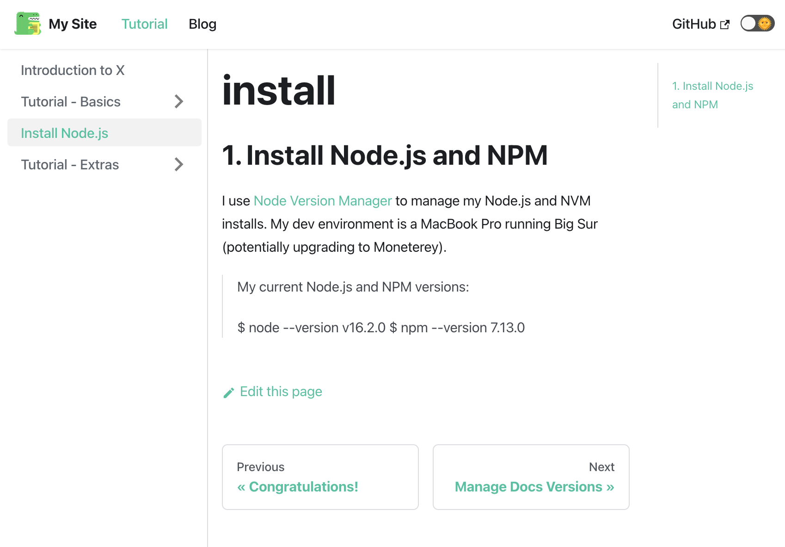
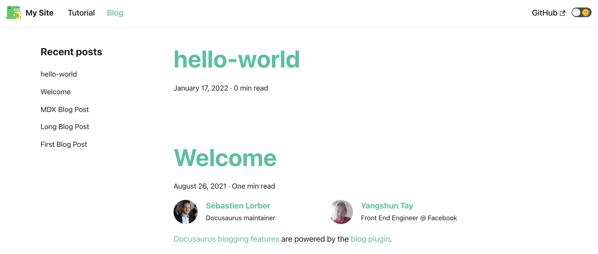
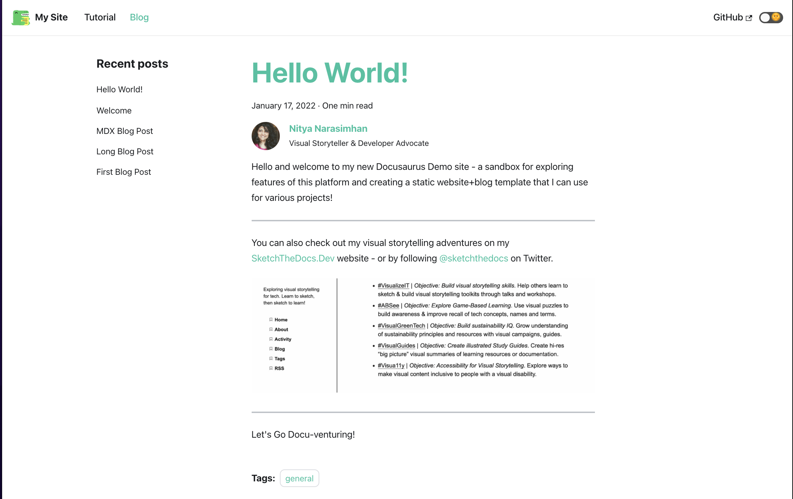

Used [Fast Track](https://docusaurus.io/docs#fast-track) option to scaffold a basic _classic_ website and walked through the 5-minute tutorial walkthrough on content creation and configuration.

---

# PART A: Setup

My notes on setting up, previewing, building, and testing, a Docusaurus site.
 1. Install Node.JS
 2. Install Docusaurus, Scaffold Site
 3. Explore Scaffolded Site
 4. Explore Site Source
 5. Build Static Site for Deploy
 6. Test Build Locally

 ---

## 1. Install Node.JS

I use [Node Version Manager](https://github.com/nvm-sh/nvm) to manage my Node.js and NVM installs. My dev environment is a MacBook Pro running Big Sur (potentially upgrading to Moneterey).

My current Node.js and NPM versions:

```
$ node --version
v16.2.0
$ npm --version
7.13.0
```
---

## 2. Install Docusaurus, Scaffold Site

Create a sample site with `classic` theme using one of the following commands. [Additional themes](https://docusaurus.io/docs/api/themes) are planned.
 * `npm init docusaurus@latest www classic`
 * `npx create-docusaurus@latest www classic` 

I got the following dependency error for my current Node.js environment. The same command worked without error on a different device with older node and npm versions - so your mileage may vary.

```
$npx create-docusaurus@latest www classic
[INFO] Creating new Docusaurus project...
[INFO] Installing dependencies with npm...
..
..
npm ERR! Could not resolve dependency:
npm ERR! peer react@"^16.13.1" from @mdx-js/runtime@1.6.22
npm ERR! Fix the upstream dependency conflict, or retry
npm ERR! this command with --force, or --legacy-peer-deps
npm ERR! to accept an incorrect (and potentially broken) dependency resolution.
..
..
[INFO] The site directory has already been created, and you can retry by typing:

  `cd www`
  `npm install`
```

I used the `--force` option to overcome the error, and it worked as advertised.

```
$ cd www
$ npm install --force
npm WARN using --force Recommended protections disabled.
```
`SUCCESS!!` - This creates the `www/` folder with site source.

---

## 3. Explore Scaffolded Site

Let's see what the default site looks like - you can preview it locally using `npx docusaurus start` from the source folder.

```
$ cd www
$ npx docusaurus start
[INFO] Starting the development server...
[SUCCESS] Docusaurus website is running at http://localhost:3000/.
```

This launches the browser for you by default, with built-in hot reload so the preview automatically reflects changes to the code. Here is a screenshot of the default scaffolded site:


---

## 4. Explore Site Source

The Docusaurus [project structure](https://docusaurus.io/docs/installation#project-structure) (in the `www/` folder) is as follows: 

```
    $ cd www/
    $ ls -l

    README.md		
    blog/			
    docusaurus.config.js	
    package-lock.json	
    sidebars.js		
    static/
    babel.config.js		
    docs/			
    node_modules/		
    package.json		
    src/
```

The key _content folders_ are:
 * `static/` - maintains static assets (copied as-is to root of `build/`) 
 * `src/` - maintains custom React components or non-documentation content
 * `src/pages` - content for standalone site pages. See [pages guide](https://docusaurus.io/docs/creating-pages)
 * `blog/` - content for dated articles. See [blog guide](https://docusaurus.io/docs/blog)
 * `docs/` - content for persistent collections. See [docs guide](https://docusaurus.io/docs/docs-markdown-features)


The key _configuration files_ are:
 * `package.json` = configure the React app (via npm)
 * `docusaurus.config.js` = configure Docusaurus site
 * `sidebar.js` - configure Documentation sidebar.

---

## 5. Build Static Site For Deploy

Use `npm run build` to get deployment-ready files generated in the `build/` folder (default location). This can later be setup with automated actions for testing and deployment to a targeted hosting provider.

```
$ cd www/
$ npm run build

> www@0.0.0 build
> docusaurus build

[INFO] [en] Creating an optimized production build...
..
..
[SUCCESS] Generated static files in build.
[INFO] Use `npm run serve` command to test your build locally.
```

This is the default structure within `build/` - some things to note:
 * SEO-friendly = many granular `.html` files.
 * Static assets in `www/static` copied verbatim to `build/` root.
 * Sitemap, Index, 404 HTML pages created by default.
 * `/www/docs` maps to `/docs` site route.

```
$ ls build/*
build/404.html          
build/index.html        
build/sitemap.xml

build/assets:
css     images  js

build/blog:
archive         first-blog-post long-blog-post  rss.xml         welcome
atom.xml        index.html      mdx-blog-post   tags

build/docs:
intro           tutorial-basics tutorial-extras

build/img:
docusaurus.png                  undraw_docusaurus_mountain.svg
favicon.ico                     undraw_docusaurus_react.svg
logo.svg                        undraw_docusaurus_tree.svg
tutorial

build/markdown-page:
index.html
```
Some notes on the build:
  * More granular `*.html` files = SEO-friendly
  * Static files and folders in `www/static` = copied verbatim to `/build/.`
  * Sitemap, index and 404 (page not found) = created by default
  * Default routes:
    * `www/docs` => `/docs`
    * `www/blog` => `/blog`
    * `www/src/pages/<path>` => `/<path>/index.html`

---

## 6. Test Static Build locally

Use `npm run server` to serve the build version for local testing or validation:

```
$ cd www/
$ npm run serve

> www@0.0.0 serve
> docusaurus serve

[SUCCESS] Serving build directory at http://localhost:3000/.
```

_Note_: This will not launch the browser automatically for preview, or provide hot-reload capability (refresh page if rebuilt from source). It simply runs a local server to host the `build/` content so you can validate routes, performance and user experience.

---

# PART B. Customize & Configure Site

The Fast Track workflow includes a [5-minute tutorial](http://localhost:3000/docs/intro) that covers key features of content creation and site customization - including:

 1. Create a Page
 2. Create a Document
 3. Create a Blog Post
 4. Customize with Markdown
 5. Deploy Your Site
 6. Manage Docs Versions
 7. Translate Your Site

---

## B.1 Create a Page

Standalone pages are created in `src/pages` using markdown (`.md`) or React (`.js`) for content formatting. A page created at `src/pages/<name>` is hosted at the `/<name>` route within website.


> `EXAMPLE 1`: "About" page using Markdown

Markdown files use [frontmatter](https://docusaurus.io/docs/api/plugins/@docusaurus/plugin-content-docs#markdown-frontmatter) to provide meaningful metadata that translates into better SEO (by mapping to `<header>` section `<meta>` elements.) 

Here is the `src/pages/about.md` file mapping to `/about` route in website.


```about.md
---
title: About This Site
description: This is the site's About page, describing the author and objectives
image: https://pbs.twimg.com/profile_banners/759720/1631290011/1500x500
---

# Welcome 

Welcome to my new website! Thanks for stopping by - it's a work in progress so do check back later for updates about me and the objectives of this project!


```

> `EXAMPLE 2`: "Roadmap" page using React

Use [JSX Syntax](https://reactjs.org/docs/introducing-jsx.html) to embed structure (HTML) and style (CSS) information within a component (JS) representing that page. As before, `src/pages/roadmap.js` gets mapped to the `/roadmap` route in the site.


```js
import React from 'react';
import Layout from '@theme/Layout';

export default function RoadmapPage() {
  return (
    <Layout title="Roadmap">
        <div
            style={{
            display: 'flex',
            flexDirection: `column`,
            justifyContent: 'center',
            alignItems: 'center',
            fontSize: '30px',
            }}>

            <h1>My Learning Roadmap</h1>
            <p>This is a React-generated page example..</p>
            <ol>
                <li>Item 1 </li>
                <li>Item 2 </li>
                <li>Item 3 </li>
                <li>Item 4 </li>
                <li>Item 5 </li>
            </ol>
        </div>
    </Layout>
  );
}
```

JSX makes the HTML structure and CSS style "readable" within the code - making it easier to write/bind the JS code to manage interactions or event handling.

React components make it easier to reuse functional blocks (HTML, CSS, JS) and bind templatized user interfaces to dynamic data for rendering. Plus, the ability to use/extend a rich collection of community-created libraries and UI components.

---

## B.2 Create a Document

A Document is a _group or collection_ of standalone pages that have a shared context - represented by creating a subfolder within `docs/`. This automatically gives you a sidebar, navigation, and versioning support.

 * `Sidebar`: lists the items within the group in a predefined order, in side menu. This can be customized in 2 ways:
    * using _frontmatter_ - locally, in each page file.
    * using _sidebars.js_ - globally, in central configuration file.
 * `Navigation`: creates default _Previous_ and _Next_ links when rendering each page in group, making it easier for users to follow flows.
 * [`Versioning`](https://docusaurus.io/docs/versioning): helps maintain multiple versions of a collection of pages - e.g., to support current, legacy, and upcoming, releases of documentation. Note that this adds overheads to build, to use with care.


### B.2.1 | Document with Auto-generated sidebar

The simplest way to create a new collection - is to create a new page (using Markdown or React) under `docs/` and save it with optional _sidebar-related_ frontmatter for customizing the auto-generated sidebar.

Example: `docs/about.md` mapping to `/about` site route.

```markdown
---
title: "Install Node.js"
sidebar_label: 'Install Node.js'
sidebar_position: 3
tags: [general]
---

I use [Node Version Manager](https://github.com/nvm-sh/nvm) to manage my Node.js and NVM installs. My dev environment is a MacBook Pro running Big Sur (potentially upgrading to Moneterey).

> My current Node.js and NPM versions:
> 
> $ node --version
> v16.2.0
> $ npm --version
> 7.13.0

```

The Document preview is shown below. If you had a preview session open, it should automagically update to show the sidebar with the new page at position 3. Note that `Previous` and `Next` navigational cues also update to reflect this position in flow.





### B.2.1 | Document with Custom-configured sidebar

As the number of Documents (page collections) grows, you might want to customize sidebars presentation on a global level. Use the `sidebars.js` file to do so. 

Here is what the default file looks like - showing that documents in the default directory (`.`) are of type `autogenerated` (based on directory structure).

```js

/* Default sidebars.js */

// @ts-check
/** @type {import('@docusaurus/plugin-content-docs').SidebarsConfig} */
const sidebars = {
  tutorialSidebar: [
    {type: 'autogenerated', dirName: '.'}
  ],
};

module.exports = sidebars;
```

Sidebars are JavaScript objects that defines the entire sidebar for a given document. The `sidebars.js` file contains the default array of sidebar objects for your site.

 * Customization | uses different [item types](https://docusaurus.io/docs/sidebar#understanding-sidebar-items) like _category_, _doc_ and _link_. 
 * Association | When users visit a route or page (_item_) directly, they automatically see the _associated_ sidebar object with the item highlighted. If multiple item groups exist for that object, the other groups are collapsed. | [Learn more](https://docusaurus.io/docs/sidebar#default-sidebar). 
 * Resolution | If the page occurs in multiple sidebar objects, you can use the _ref_ type to resolve the primary association. | [Learn more](https://docusaurus.io/docs/sidebar#sidebar-association).

Here is a revised `sidebar.js` file.

```js

  tutorialSidebar: [
    {
      type: 'category',
      label: 'Getting Started',
      items: [
        'intro', 
        'install',
      ],
    },
    {
      type: 'category',
      label: 'Tutorial-Basics',
      items: [
        'tutorial-basics/create-a-page',
        'tutorial-basics/create-a-document',
        'tutorial-basics/create-a-blog-post', 
        'tutorial-basics/deploy-your-site',
        'tutorial-basics/markdown-features',
        'tutorial-basics/congratulations',
      ],
    },
  ],
```

The syntax allows for further simplification that makes this more readable and concise. For instance, this is equivalent to the above:

```js

  tutorialSidebar: [
    {
      'Getting Started' : ['intro', 'install'],
    },
    {
      'Tutorial-Basics' : [
        'tutorial-basics/create-a-page',
        'tutorial-basics/create-a-document',
        'tutorial-basics/create-a-blog-post', 
        'tutorial-basics/deploy-your-site',
        'tutorial-basics/markdown-features',
        'tutorial-basics/congratulations',
      ],
    },
  ],
```

---

## B.3 Create a Blog Post

The `docs/` folder is great for Document collections - _persistent_, structured groups of pages. The `blog/` folder is for collections of Posts - articles that provide _dated_ insights or time-specific updates.

The [Blog](https://docusaurus.io/docs/blog) capability includes automatically-generated pages for `tags`, `rss feed` and `blog index` - along with rich [frontmatter](https://docusaurus.io/docs/api/plugins/@docusaurus/plugin-content-blog#markdown-frontmatter) for improved SEO, including attributes like: 

 * `author`, `authors`, `author_url`, `author_image_url`, `author_title` = see [author guide](https://docusaurus.io/docs/blog#blog-post-authors).
 * `title`, `date`, `keywords`, `description`, `tags` = core attributes
 * `slug` = blog post URL (descriptive path)
 * `image` = cover image 
 * `hide_table_of_contents`, `toc_min_heading_level`, `toc_max_heading_level` = TOC visibility and format
 * `draft` = published or draft (boolean flag)

Let's create a blog post!

> **EXAMPLE:** My First Blog Post

Creating a file with name in format `blog/<yyyy-mm-dd>-<slug>.md` allows Docusaurus to derive `date` and `slug` fields automtically - but they can always be overridden explicitly in front-matter.

_Example_: Create a empty file at `blog/2022-01-17-hello-world.md` and save it. The hot-reload preview will automtically refresh to show the blank post below:
 * seen at route `/blog/2022-01-17-hello-world` (slug from filename)
 * with a default publication date of `January 17, 2022` (from filename)
 * and default blog post title of `hello-world` (from filename)



> **EXAMPLE:** Update Blog Post Frontmatter, contents

We want to have a simpler slug, and we want the title to have better punctuation and mixed case! Let's update the frontmatter, and add some content to the blog post.

```md
---
slug: hello-world
title: Hello World!
authors:
  - name: Nitya Narasimhan
    title: Visual Storyteller & Developer Advocate
    url: https://github.com/nitya
    image_url: https://github.com/nitya.png
tags: [general]
---

Hello and welcome to my new Docusaurus Demo site - a sandbox for exploring features of this platform and creating a static website+blog template that I can use for various projects!

---

You can also check out my visual storytelling adventures on my [SketchTheDocs.Dev](https://sketchthedocs.dev) website - or by following [@sketchthedocs](https://twitter.com/sketchthedocs) on Twitter.


---

Let's Go Docu-venturing!
```

Save this - and we get an updated preview as shown below with:
 * page route now set to `/blog/hello-world`
 * title updated in blog index
 * blog post reading time updated to reflect content
 * tags added (and [tags](http://localhost:3000/blog/tags) page updated)



Perfect!! Alright - so what can we do next?

---

## B.4 Customize with Markdown

[Markdown](https://daringfireball.net/projects/markdown/) is an easy, widely-supported, and intuitive-to-use format and tool for converting text into valid HTML. Docusaurus supports standard Markdown by default including links, images, quotes, and codeblocks. 

It also uses [MDX](https://mdxjs.com/) - a Markdown rendering engine that can embed React components - to provide more enhanced features. This allows you to use "HTML-like" syntax within Markdown documents. You can validate you MDX using [this sandbox](https://mdx-git-renovate-babel-monorepo-mdx.vercel.app/playground/).

Check out [Markdown Features](https://docusaurus.io/docs/markdown-features) to explore enhanced Markdown capabilities including:
 * [React](https://docusaurus.io/docs/markdown-features/react) components
 * [Tabs](https://docusaurus.io/docs/markdown-features/tabs) component
 * [Codeblocks](https://docusaurus.io/docs/markdown-features/code-blocks) enhanced - [interactive code](https://docusaurus.io/docs/markdown-features/code-blocks#interactive-code-editor), [line highlights](https://docusaurus.io/docs/markdown-features/code-blocks#line-highlighting), [multi-language tabs](https://docusaurus.io/docs/markdown-features/code-blocks#multi-language-support-code-blocks)
 * [Admonitions](https://docusaurus.io/docs/markdown-features/admonitions) - for remarks
 * [Headings](https://docusaurus.io/docs/markdown-features/headings) enhanced - with ids for addressability
 * [Inline TOC](https://docusaurus.io/docs/markdown-features/inline-toc) - created from page structure
 * [Assets](https://docusaurus.io/docs/markdown-features/assets) inclusion - files, images, svg, themed images, static assets
 * [Plugins](https://docusaurus.io/docs/markdown-features/plugins) for extensibility
 * [Math](https://docusaurus.io/docs/markdown-features/math-equations) equations - using [KaTeX](https://katex.org/)
 * [Head](https://docusaurus.io/docs/markdown-features/head-metadata) metadata - using frontmatter and `<head>` MDX

We'll play with these in posts and docs over time.

---

## B.5 Deploy your site

Once built, the `build/` folder can be deployed to various hosting providers. Learn more in this extensive [Deployment Guide](https://docusaurus.io/docs/markdown-features/head-metadata). 

For now, I'm exploring two options:
 * [Deploy to GitHub Pages](https://docusaurus.io/docs/deployment#deploying-to-github-pages) and [Trigger With GitHub Actions](https://docusaurus.io/docs/deployment#triggering-deployment-with-github-actions)
 * [Deploy to Azure Static Web Apps](https://dev.to/sumitkharche/deploy-a-docusaurus-app-on-azure-static-web-apps-2dpj)  and [Trigger With GitHub Actions](https://docs.microsoft.com/en-us/azure/static-web-apps/build-configuration?tabs=github-actions)

In both cases, the goal is to automate build-deploy workflows that run on each code commit, to ensure that the updated site is deployed without manual intervention.

---

## B.6 Manage Docs versions

On my `TO-DO` list - complete the [versioning tutorial](/docs/tutorial-extras/manage-docs-versions) and learn how to:
 * Use [versioning](https://docusaurus.io/docs/versioning) to manage documentation for current, next, and legacy, releases.
 * Render [dropdown](https://docusaurus.io/docs/api/themes/configuration#navbar-docs-version-dropdown) menus for versions
 * Update, add and delete new versions.

---

## B.7 Translate Docs Site

On my `TO-DO` list - learn to support [i18n](/docs/tutorial-extras/translate-your-site) by
 * creating language-specific translation files
 * rendering a dropdown menu for easy language-switching
 * building for specific locale (vs. all) 

---
